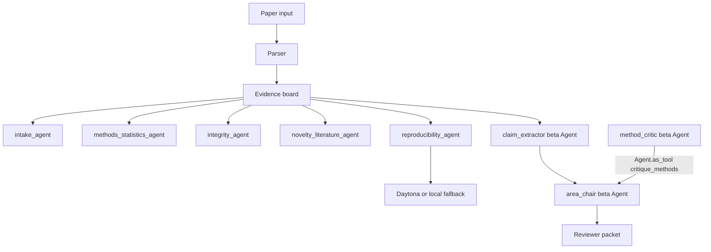

# RefereeOS-AG2

**中文一句话：**把科研论文变成一份可追踪、可复核、可交给真人编辑的审稿准备包。  
**English tagline:** Turn a preprint into an auditable reviewer packet.

RefereeOS-AG2 是基于真实 hackathon 项目 [VJDiPaola/RefereeOS](https://github.com/VJDiPaola/RefereeOS) 改造的 C5-AG2 科研赛道作品。它不是简单套一个聊天机器人，而是把原项目已有的论文解析、证据板、复现实验检查和风险检测流程，升级成一个混合式 multi-agent 系统：确定性 agent 负责稳定抽取与检查，AG2 Beta agent 负责更接近真人审稿人的 claims extraction、methods critique 和 area-chair synthesis。

项目定位很明确：**辅助审稿，不替代审稿。**  
它帮助编辑或审稿人更快看清一篇论文的核心主张、证据链、方法学风险、复现风险和需要追问作者的问题。

---

## Submission Metadata

| Field | Value |
|---|---|
| C5 track | `scientific` |
| My repo | `https://github.com/Usernames686/RefereeOS` |
| Base repo | `https://github.com/VJDiPaola/RefereeOS` |
| Core upgrade | AG2 Beta multi-agent reviewer layer |
| AG2 API used | `autogen.beta.Agent`, `Agent.as_tool(...)` |
| Offline demo | `python scripts/offline_demo.py` |
| Test command | `python -m unittest discover -s tests -v` |

---

## Problem

科研审稿前期最耗时间的地方，往往不是写最终意见，而是把论文拆开：

- 论文到底提出了哪些 central claims？
- 每个 claim 对应哪些证据？
- 方法和统计设计有没有明显弱点？
- 结果是否依赖不可复现的 artifact？
- 论文里是否有 prompt injection、异常指令或完整性风险？
- 编辑应该找什么方向的 reviewer？

RefereeOS-AG2 解决的是这个“审稿前准备”问题。它把一篇 manuscript 转成一个结构化 evidence board，再由多个 agent 分工审阅，最后输出一份 reviewer packet，让真人审稿人可以从更高质量的起点开始工作。

---

## What It Does

输入可以是：

- 论文纯文本
- Markdown fixture
- PDF
- LaTeX archive

输出包括：

- `evidence_board.json`：结构化证据板
- reviewer packet markdown：给编辑/审稿人的审阅准备包
- agent trace：每个 agent 的处理步骤
- concerns list：方法、统计、完整性、复现等风险列表
- triage recommendation：例如 `Ready for human review` 或 `Possible integrity issue`

一个典型流程是：

1. 上传或选择一篇论文。
2. parser 提取标题、摘要、claims、methods、results。
3. deterministic agents 先生成稳定的 evidence board。
4. reproducibility agent 尝试运行 artifact probe，必要时使用本地 fallback。
5. AG2 Beta reviewer team 继续抽取 claims、批判方法、综合 area-chair packet。
6. 人类编辑读取最终 reviewer packet，而不是直接接受机器结论。

---

## What I Changed For C5-AG2

| Change | Files | Why it matters |
|---|---|---|
| Added AG2 Beta reviewer team | `backend/agents/beta_review.py`, `ag2_reviewer.py` | 新增真实 `autogen.beta.Agent` 工作流，不是文档里的概念展示。 |
| Added agent-as-tool collaboration | `backend/agents/beta_review.py` | `method_critic` 通过 `Agent.as_tool(name="critique_methods")` 暴露给 `area_chair` 调用。 |
| Added provider flexibility | `.env.example`, `backend/agents/beta_review.py` | 支持 `DEEPSEEK_API_KEY`、`OPENROUTER_API_KEY`、`OPENAI_API_KEY`、`GEMINI_API_KEY`。 |
| Added no-key offline demo | `scripts/offline_demo.py` | 没有 LLM key 时也可以展示完整 deterministic pipeline。 |
| Added C5 docs | `AI_LOG.md`, `ATTRIBUTION.md`, `GROUP_SUBMISSION.md`, `PROJECT_INTRO.md` | 补齐 AI 迭代记录、拿来说明、群提交说明和项目介绍。 |
| Extended tests | `tests/test_orchestrator.py` | 覆盖 provider detection、blank env defaults、plain-text parsing 等关键逻辑。 |

---

## Multi-Agent Architecture



| Agent | Role | Implementation |
|---|---|---|
| `intake_agent` | 识别论文 profile、claims、基础结构 | Deterministic Python |
| `methods_statistics_agent` | 检查方法、统计、实验设计风险 | Deterministic Python |
| `integrity_agent` | 识别 prompt injection 和可疑文本 | Deterministic Python |
| `novelty_literature_agent` | 提醒相关工作和 novelty 风险 | Deterministic Python |
| `reproducibility_agent` | 运行 artifact / metric probe | Daytona + local fallback |
| `claim_extractor` | 从 manuscript excerpt 中抽取 3-6 个核心科研主张 | `autogen.beta.Agent` |
| `method_critic` | 像审稿人一样批判 methods、statistics、reproducibility | `autogen.beta.Agent` |
| `area_chair` | 调用 `method_critic`，综合出给真人编辑看的 reviewer packet | `autogen.beta.Agent` + tool use |

---

## Why This Counts As AG2 Multi-Agent

这个项目不是把一个 LLM prompt 包一层 CLI。它有三层协作：

1. **Deterministic review agents**  
   原 RefereeOS 的稳定审稿流程保留下来，负责可测试、可复现的基础分析。

2. **AG2 Beta reviewer agents**  
   新增 `claim_extractor`、`method_critic`、`area_chair`，用 AG2 Beta API 组织 LLM agent。

3. **Agent-as-tool handoff**  
   `area_chair` 不只是读取 `method_critic` 的文本，而是把 `method_critic` 注册成工具：

```python
method_critic.as_tool(
    name="critique_methods",
    description="Ask the method critic to review claims and manuscript context.",
)
```

这让 area-chair agent 可以在最终 synthesis 前主动调用 methods reviewer，符合 C5-AG2 要求的“会编排 multi-agent”能力。

---

## Quick Start

```powershell
git clone https://github.com/Usernames686/RefereeOS.git
cd RefereeOS
python -m pip install -r requirements.txt
copy .env.example .env
```

Run the deterministic demo with no LLM key:

```powershell
python scripts/offline_demo.py
python -m unittest discover -s tests -v
```

Expected offline demo shape:

```text
RefereeOS deterministic offline demo
Recommendation: Ready for human review
Claims: 3
Concerns: 2
Agent steps: 6
Saved evidence board: outputs/offline_demo/evidence_board.json
```

---

## AG2 Beta Reviewer Mode

Add one provider key to `.env`. You only need one.

```ini
DEEPSEEK_API_KEY=
OPENROUTER_API_KEY=
OPENAI_API_KEY=
GEMINI_API_KEY=

# Optional. Leave blank to use the provider default.
AG2_MODEL=
```

Provider defaults:

| Provider key | Default model / route |
|---|---|
| `DEEPSEEK_API_KEY` | `deepseek-chat` |
| `OPENROUTER_API_KEY` | `google/gemini-3-flash-preview` through OpenRouter |
| `OPENAI_API_KEY` | `gpt-4o-mini` |
| `GEMINI_API_KEY` | `gemini-2.5-flash` |

Run:

```powershell
python ag2_reviewer.py --fixture clean
python ag2_reviewer.py --fixture suspicious
python ag2_reviewer.py --text "Title: Demo Paper..."
```

If no LLM key is configured, the AG2 runner exits cleanly and tells you to use the offline demo instead.

---

## Web UI

```powershell
python main.py
cd frontend
npm install
npm run dev
```

Open:

- Backend: `http://localhost:8000`
- Frontend: `http://localhost:5173`
- Health: `http://localhost:8000/healthz`

---

## Demo Plan

60-90 second demo script:

1. Open the repo and say: “This is a C5-AG2 scientific-track fork of RefereeOS.”
2. Show `README.md`, `AI_LOG.md`, and `ATTRIBUTION.md`.
3. Run `python scripts/offline_demo.py` to prove the project works without an LLM key.
4. Show the output: recommendation, claim count, concern count, agent steps.
5. If a key is available, run `python ag2_reviewer.py --fixture clean`.
6. Point to `backend/agents/beta_review.py` and explain:
   - `claim_extractor` extracts scientific claims.
   - `method_critic` reviews methods and evidence quality.
   - `area_chair` calls `method_critic` through `Agent.as_tool(...)`.
7. Run `python -m unittest discover -s tests -v`.
8. Close with: “This does not replace peer review. It prepares peer review.”

---

## Tests

```powershell
python -m unittest discover -s tests -v
```

The test suite covers:

- deterministic reviewer packet generation
- clean and suspicious manuscript fixtures
- prompt-injection detection
- reproducibility fallback behavior
- uploaded manuscripts without artifact reuse
- AG2 Beta provider detection
- blank environment default handling
- plain-text / JSON synthesis parsing

---

## C5-AG2 Checklist

| Requirement | Status |
|---|---|
| Borrow from a real GitHub project | Done: `VJDiPaola/RefereeOS` |
| Add or improve multi-agent behavior | Done: deterministic agents + AG2 Beta reviewer team |
| Add a second / specialized agent | Done: `claim_extractor`, `method_critic`, `area_chair` |
| Use AG2 Beta correctly | Done: `autogen.beta.Agent` |
| Use agent-as-tool | Done: `method_critic.as_tool(...)` |
| Provide AI iteration log | Done: `AI_LOG.md` |
| Provide attribution / borrow notes | Done: `ATTRIBUTION.md` |
| Provide group submission text | Done: `GROUP_SUBMISSION.md` |
| Run without paid key for demo | Done: `scripts/offline_demo.py` |
| Include tests | Done: `tests/` |

---

## Ethical Boundary

RefereeOS-AG2 prepares human peer review. It does not make final publication accept/reject decisions, and it should not be used as an automated gatekeeper. The intended user is a human editor, reviewer, or researcher who wants a faster and more auditable way to start the review process.

---

## Credits

- Original base project: [VJDiPaola/RefereeOS](https://github.com/VJDiPaola/RefereeOS)
- AG2 framework: [ag2ai/ag2](https://github.com/ag2ai/ag2)
- C5-AG2 starter package and rubric
