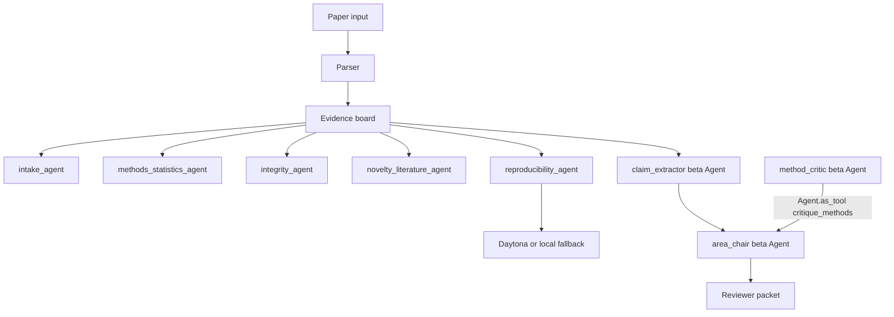

# RefereeOS-AG2

**Multi-agent peer-review prep: extract, critique, synthesize.**

**Track:** `scientific`  
**Base / fork source:** [VJDiPaola/RefereeOS](https://github.com/VJDiPaola/RefereeOS)  
**AG2 version:** `ag2 >= 0.9` with `autogen.beta`  
**Tagline:** Turn a preprint into an auditable reviewer packet.

---

## What It Does

RefereeOS-AG2 turns a scientific manuscript into an auditable reviewer packet for human editors. It extracts paper claims, links evidence, flags methodology and integrity risks, runs reproducibility probes, and synthesizes a final review-prep packet.

It does not replace peer review. It prepares peer review.

**Input:** paper text, markdown fixture, PDF, or LaTeX archive  
**Output:** evidence board JSON + reviewer packet markdown + agent trace

---

## What I Changed For C5-AG2

| Change | Files | Why it matters |
|---|---|---|
| Added AG2 Beta reviewer team | `backend/agents/beta_review.py`, `ag2_reviewer.py` | Adds a real `autogen.beta.Agent` pipeline: `claim_extractor`, `method_critic`, `area_chair`. |
| Added agent-as-tool collaboration | `backend/agents/beta_review.py` | `method_critic` is exposed via `Agent.as_tool(name="critique_methods")` and called by `area_chair`. |
| Added OpenRouter / DeepSeek / Gemini config | `.env.example`, `backend/agents/beta_review.py` | Avoids hard-locking the project to one provider. |
| Upgraded AG2 dependency | `requirements.txt` | Uses `ag2[openai,gemini]>=0.9.0` for Beta support. |
| Added C5 submission docs | `AI_LOG.md`, `ATTRIBUTION.md`, `GROUP_SUBMISSION.md` | Meets Elite20 documentation and attribution requirements. |

---

## Multi-Agent Design



| Agent | Role | Implementation |
|---|---|---|
| `intake_agent` | Extracts profile and claims | Deterministic Python |
| `methods_statistics_agent` | Flags statistical and methods risks | Deterministic Python |
| `integrity_agent` | Detects prompt-injection / suspicious manuscript text | Deterministic Python |
| `novelty_literature_agent` | Adds related-work risks | Deterministic Python |
| `reproducibility_agent` | Runs artifact probe | Daytona + local fallback |
| `claim_extractor` | Extracts claims from manuscript excerpt | `autogen.beta.Agent` |
| `method_critic` | Critiques methods and evidence quality | `autogen.beta.Agent` exposed as tool |
| `area_chair` | Synthesizes human-facing reviewer packet | `autogen.beta.Agent` |

---

## 5-Minute Setup

```powershell
git clone https://github.com/Usernames686/RefereeOS.git
cd RefereeOS
python -m pip install -r requirements.txt
copy .env.example .env
```

For deterministic local demo with no LLM key:

```powershell
python scripts/offline_demo.py
python -m unittest discover -s tests -v
```

For AG2 Beta reviewer mode, add one key to `.env`:

```ini
OPENROUTER_API_KEY=sk-or-...
AG2_MODEL=google/gemini-3-flash-preview
```

Then run:

```powershell
python ag2_reviewer.py --fixture clean
python ag2_reviewer.py --fixture suspicious
```

---

## Web UI

```powershell
python main.py
cd frontend
npm install
npm run dev
```

Open:

- Backend: `http://localhost:8000`
- Frontend: `http://localhost:5173`
- Health: `http://localhost:8000/healthz`

---

## Expected CLI Output

```text
================================================================
RefereeOS AG2 Beta Peer Review
Source: fixture:clean
Title: Synthetic Clean Benchmark
================================================================
Engine: AG2 Beta
Model: google/gemini-3-flash-preview
Agents: claim_extractor -> method_critic -> area_chair
Collaboration: area_chair uses method_critic via Agent.as_tool(...)
```

Without an LLM key, the deterministic RefereeOS pipeline and tests still run.

---

## Tests

```powershell
python -m unittest discover -s tests -v
```

The test suite covers:

- deterministic reviewer packet generation
- prompt-injection detection
- reproducibility fallback behavior
- AG2 Beta provider detection
- plain-text / JSON synthesis parsing

---

## Demo Script

1. Show README and explain the fork source.
2. Run `python scripts/offline_demo.py` to show deterministic reviewer packet output.
3. Run `python ag2_reviewer.py --fixture clean` with an AG2 key to show Beta agents.
4. Point out the agent-as-tool handoff: `method_critic` -> `area_chair`.
5. Open `AI_LOG.md` and `ATTRIBUTION.md`.
6. Run tests.

---

## Ethical Boundary

RefereeOS-AG2 prepares human peer review. It does not make final publication accept/reject decisions.

---

## Credits

- Original base project: [VJDiPaola/RefereeOS](https://github.com/VJDiPaola/RefereeOS)
- AG2 framework: [ag2ai/ag2](https://github.com/ag2ai/ag2)
- C5-AG2 starter package and rubric
